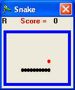



## Mini Snake

### Description

Mini Snake is a simple game ... It's famouse, so you know it. It's available on mobiles too !

Its form is small, so it is very useful if you want to play at work ... ha ha ha

1.If the snake have a contact with himself will die, and this is the only case ... It happens if it come back over himself, or cross himself.

2.The snake should eat red foods to get score. The red foods could appear on snake's body too, in this case it is difficult to eat them, because ...

3.Foods will appear each 5 seconds and will not disappear unless they appear on snake's body !
 
### More Info
 

             |
---                |---
**Submitted On**   |2005-07-18 18:16:58
**By**             |[Mahdi Shakouri Rad](https://github.com/Planet-Source-Code/PSCIndex/blob/master/ByAuthor/mahdi-shakouri-rad.md)
**Level**          |Beginner
**User Rating**    |4.3 (13 globes from 3 users)
**Compatibility**  |VB 6\.0
**Category**       |[Games](https://github.com/Planet-Source-Code/PSCIndex/blob/master/ByCategory/games__1-38.md)
**World**          |[Visual Basic](https://github.com/Planet-Source-Code/PSCIndex/blob/master/ByWorld/visual-basic.md)
**Archive File**   |[Mini\_Snake1915067192005\.zip](https://github.com/Planet-Source-Code/mahdi-shakouri-rad-mini-snake__1-61781/archive/master.zip)

